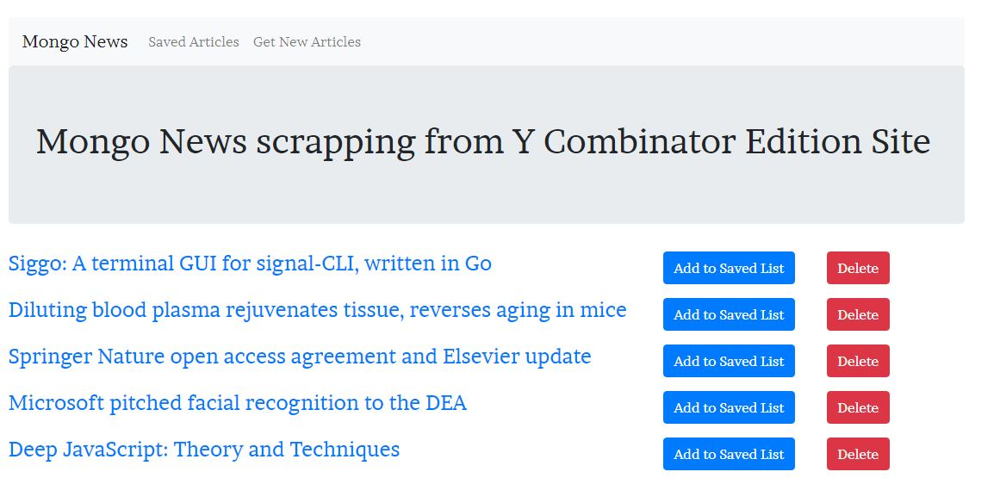
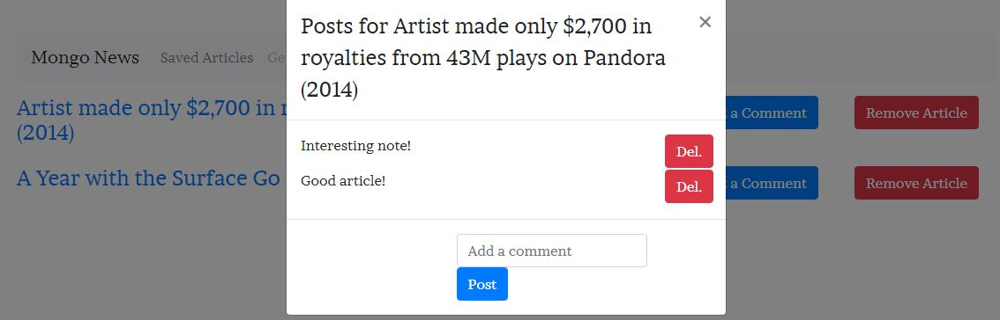

# Mongo News

## Overview

* App that connects to the news site (Y Combinator) and save the recent information to the DB
* The information displayed in the page is the headline, summary and URL for the original article
* There is a list to save the articles for your interests
* For saved articles exists the option to delete the article for the list
* For a saved article user can post a comment that can be viewed by any other user

## Technologies used to develop the app
- HTML5
- CSS3
- Bootstrap
- Javascript
- Express.js
- Handlebars.js
- Mongoose
- Cheerio
- Axios
- Mongo DB

## App Link
https://jfsh-mongonews.herokuapp.com/

## Author
ISC Francisco Silva
